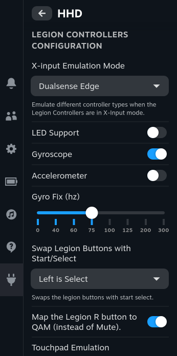

# Decky HHD

Decky Frontend for HHD



# Requirements

- latest version of HHD installed and running
- verify the webserver is working by going to `localhost:5335` in a web browser, you should be greeted with a basic hhd webpage
- If the web server isn't working, you will need to manually enable it
  - edit `$HOME/.config/hhd/state.yml`, change `enable` under `http` to `true`, then reboot

# Install

### Prerequisites

Decky Loader and HHD must already be installed, with the hhd http server enabled and working.

### Quick Install

run the following in terminal, then reboot:

```
curl -L https://github.com/hhd-dev/hhd-decky/raw/main/install.sh | sh
```

### Manual Install

Download the latest release from the [releases page](https://github.com/hhd-dev/hhd-decky/releases)

Unzip the `tar.gz` file, and move the `hhd-decky` folder to your `$HOME/homebrew/plugins` directory

then run:

```
sudo systemctl restart plugin_loader.service
```

If the plugin didn't show up in Decky, restart your machine

## Manual build
Dependencies:
- Node.js v16.14+ 

```bash
git clone https://github.com/hhd-dev/hhd-decky.git

cd hhd-decky

# if pnpm not already installed
npm install -g pnpm

pnpm install
pnpm update decky-frontend-lib --latest
pnpm run build
```

Afterwards, you can place the entire `hhd-decky` folder in the `~/homebrew/plugins` directly, then restart your plugin service

```bash
sudo systemctl restart plugin_loader.service
```

You can see an example in [reload.sh](./reload.sh)

### Alternative manual build
Or by using npm and frozen dependencies (not officially supported by Decky):
```bash
# Clone and symlink to your homebrew dir
git clone https://github.com/hhd-dev/hhd-decky.git
cd hhd-decky

# Install deps and build
npm ci

# Build, copy, reload
npm run build
sudo rm -r $HOME/homebrew/plugins/hhd-decky/
sudo rm -rf $HOME/homebrew/logs/hhd-decky/*
sudo cp -r ../hhd-decky/ $HOME/homebrew/plugins/
sudo systemctl restart plugin_loader.service

# Or use premade sh script
. reload.sh
```
